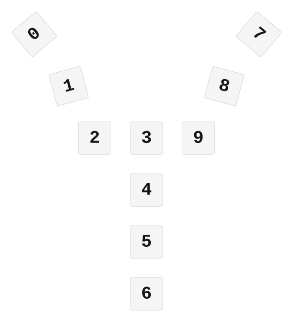

# ZMK Configuration for tronkyv1

*Generated by Shield Wizard for ZMK*



Download compiled firmware from the Actions tab. <https://zmk.dev/docs/user-setup#installing-the-firmware>

Edit your keymap <https://zmk.dev/docs/keymaps>.
User keymap is located at [`config/tronkyv1.keymap`](config/tronkyv1.keymap).

-----

<details>
<summary>
Shield Wizard Debug Information
</summary>

In case of broken configuration, here is the Shield Wizard internal data used to generate this configuration:

Commit: 5840d41ac0915092c8fe45da617ffb4bb91e1b97

```json
{"name":"tronkyv1","shield":"tronkyv1","dongle":false,"modules":[],"layout":[{"id":"01KKWAPKXDJ6WKY48CMH55C3MS","part":0,"row":0,"col":0,"w":1,"h":1,"x":0,"y":0,"r":320,"rx":0.5,"ry":0.5},{"id":"01KKWAK9X8EJG935A8YSSV3BZ3","part":0,"row":0,"col":1,"w":1,"h":1,"x":1,"y":1.5,"r":345,"rx":1.5,"ry":2},{"id":"01KKWAJ5TWE1QAAK8GART9RFHA","part":0,"row":0,"col":2,"w":1,"h":1,"x":1.75,"y":3,"r":0,"rx":0,"ry":0},{"id":"01KKWAFYWC4SFMDVS6WHF44Y4P","part":0,"row":0,"col":3,"w":1,"h":1,"x":3.25,"y":3,"r":0,"rx":0,"ry":0},{"id":"01KKWAG1FN3V20Y7XGZCATJNW7","part":0,"row":0,"col":4,"w":1,"h":1,"x":3.25,"y":4.5,"r":0,"rx":0,"ry":0},{"id":"01KKWAG5W5CDH90QWR8CSFTTZA","part":0,"row":0,"col":5,"w":1,"h":1,"x":3.25,"y":6,"r":0,"rx":0,"ry":0},{"id":"01KKWAHRYB7W0JE2MHJNSQG97G","part":0,"row":0,"col":6,"w":1,"h":1,"x":3.25,"y":7.5,"r":0,"rx":0,"ry":0},{"id":"01KKWG7C8VR2262PMQQJFYMNR7","part":0,"row":0,"col":7,"w":1,"h":1,"x":6.5,"y":0,"r":40,"rx":7,"ry":0.5},{"id":"01KKWAN820KXAN7C2K5R86WBS7","part":0,"row":0,"col":8,"w":1,"h":1,"x":5.5,"y":1.5,"r":15,"rx":6,"ry":2},{"id":"01KKWAJDS570YQ9ET3QZMX2HGF","part":0,"row":0,"col":9,"w":1,"h":1,"x":4.75,"y":3,"r":0,"rx":0,"ry":0}],"parts":[{"name":"unibody","controller":"nice_nano_v2","wiring":"direct_gnd","pins":{"d0":"input","d2":"input","d4":"input","d6":"input","d8":"input","d21":"input","d19":"input","d15":"input","d16":"input","d10":"input"},"keys":{"01KKWAPKXDJ6WKY48CMH55C3MS":{"input":"d0"},"01KKWAK9X8EJG935A8YSSV3BZ3":{"input":"d2"},"01KKWAJ5TWE1QAAK8GART9RFHA":{"input":"d4"},"01KKWAFYWC4SFMDVS6WHF44Y4P":{"input":"d6"},"01KKWAG1FN3V20Y7XGZCATJNW7":{"input":"d8"},"01KKWG7C8VR2262PMQQJFYMNR7":{"input":"d21"},"01KKWAN820KXAN7C2K5R86WBS7":{"input":"d19"},"01KKWAJDS570YQ9ET3QZMX2HGF":{"input":"d15"},"01KKWAG5W5CDH90QWR8CSFTTZA":{"input":"d16"},"01KKWAHRYB7W0JE2MHJNSQG97G":{"input":"d10"}},"encoders":[],"buses":[{"name":"spi0","devices":[],"type":"spi"},{"name":"spi1","devices":[],"type":"spi"},{"name":"spi2","devices":[],"type":"spi"},{"name":"spi3","devices":[],"type":"spi"},{"name":"i2c0","devices":[],"type":"i2c"},{"name":"i2c1","devices":[],"type":"i2c"}]}]}
```

</details>
